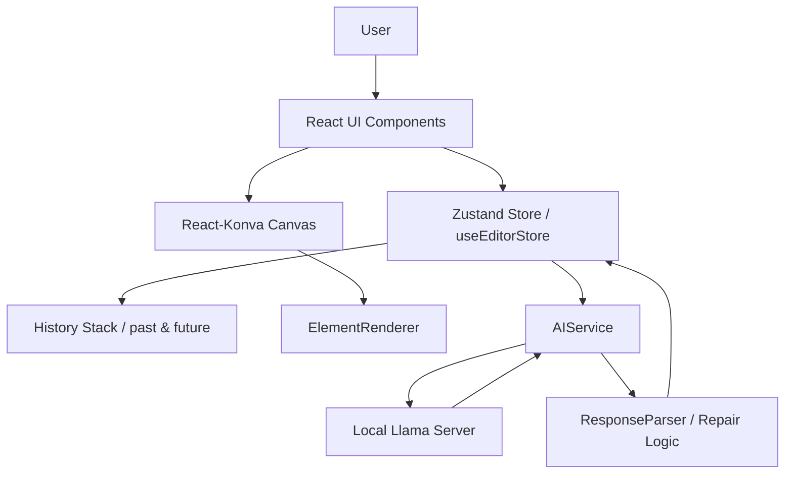
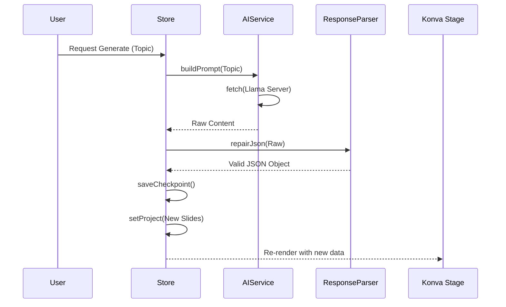

# Magic Slides Technical Specification

## 1. Overview
Magic Slides is a sophisticated web application designed for high-impact carousel generation. It leverages local AI (Llama-based) to transform topics into structured, visually styled slide decks. The application emphasizes design standards, real-time visual editing, and robust state persistence.

## 2. Technology Stack
- **Frontend**: React 18+ with Vite as the build tool.
- **Styling**: Vanilla CSS with custom design tokens.
- **Canvas Engine**: `react-konva` for high-performance slide rendering and manipulation.
- **State Management**: `zustand` with `immer` for immutable state updates and `devtools` for debugging.
- **AI Integration**: Local Llama-server (running on port 8080) for private, offline content generation.
- **Icons**: `lucide-react`.

## 3. System Architecture

### 3.1 Architecture Overview
The application follows a unidirectional data flow pattern centered around a global Zustand store.



### 3.2 State Management (`useEditorStore.ts`)
The core of the application state is managed in a flat, high-performance store.
- **Project State**: Contained in a `Project` model including slides, theme, and aspect ratio.
- **Slices**: Integrated `selectionSlice` for managing element selection across stages.
- **Undo/Redo**: Implemented via `past` and `future` stacks.
    - **Capacity**: 50 history checkpoints.
    - **Logic**: `saveCheckpoint()` deep-clones the project before any mutation. Redo stack is cleared on new actions.
- **Persistence**: Real-time synchronization of `updatedAt` timestamps to trigger rendering and thumbnail generation.

### 3.3 The AI Pipeline
The AI pipeline is designed for "Bulletproof" robustness against LLM instability.
- **AIService**: Communicates with the local server using OpenAI-compatible chat completion endpoints.
- **ResponseParser**: A multi-stage recovery system:
    1. **Pre-cleanup**: Strips preamble/markdown code blocks.
    2. **Repair**: Regex-based fixing of unquoted keys, trailing commas, and escaped quotes.
    3. **Structural Validation**: Ensures required fields (`title`, `slides`) exist and maps them to the internal `SlideLayoutType`.

## 4. Features & Logic

### 4.1 Design Standards (54/69 Rule)
The app enforces a professional design standard automatically:
- **Heading**: Default size `69px`, short and impactful.
- **Body**: Default size `54px`, clear and readable.
- **Global Application**: Store actions (`applyGlobalHeadingSize`, `applyGlobalContentSize`) allow updating all slides instantly while maintaining the hierarchy.

### 4.2 Canvas Rendering
- **Z-Index Sorting**: Elements are rendered according to a numeric `zIndex`, allowing for complex layering (Background -> Branding -> Content -> Logo).
- **Transformation Engine**: `EditorTransformer` provides bounding boxes for resizing and rotation, with persistence to the store on `dragEnd` and `transformEnd`.
- **Image Handling**: `crossOrigin="anonymous"` is enforced on all images to enable thumbnail generation (`toDataURL`) and export without "tainting" the canvas.

### 4.3 Branding & Personalization
- **Global Logo**: Injected into every slide with intelligent positioning based on the current Aspect Ratio.
- **Global Branding**: One-click application of Name, Handle, and Avatar to all slides.
- **Glassmorphism**: Support for `GlassOverlay` configurations that apply blurred, semi-transparent panels behind content.

## 5. System Flows

### 5.1 Content Generation Flow


### 5.2 Modification & History Flow
1. **Action Triggered**: e.g., `updateElement`, `deleteSlide`.
2. **Internal Guard**: `saveCheckpoint()` pushes current project to `past`.
3. **Immer Mutation**: State is updated immutably.
4. **Thumbnail Generation**: A 1-second debounced `toDataURL` call updates the filmstrip preview without blocking the main thread.

## 6. Directory Structure
```text
src/
├── core/         # Critical logic, parsers, and math helpers
├── features/     # Component-specific logic (Canvas, AI, Editor)
├── models/       # TypeScript interfaces and Enums
├── store/        # Zustand state and slices
├── services/     # External integrations (AIService)
└── styles/       # Global CSS and themes
```
